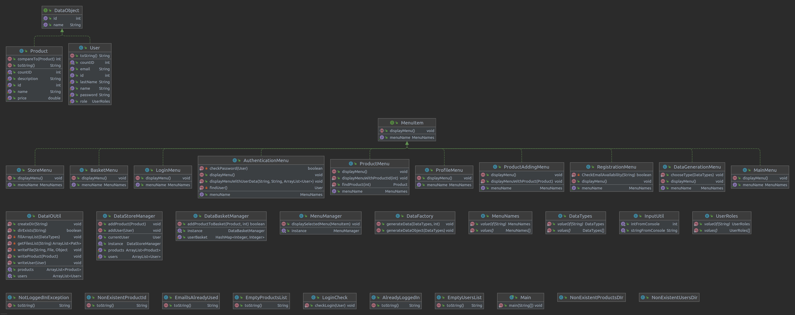

# ConsoleStore

**Original by:** [Dalalaler](https://github.com/Dalalaler);

**Docs & fixes by:** [João Xavier](https://github.com/joaovdxavier); [Lucas Nascimento](https://github.com/lluckymou); [Renan Rocha](https://github.com/renanamr).

----------
 

  
  Class diagram generated by IntelliJ IDEA

----------

ConsoleStore is a simple Java Console application where the user can:
- Login / Register
- View their profile
- Add / Remove Products from the System
- Add / Remove Products from the Basket

All information is saved in the `resources/` folder as `.JSON` files.